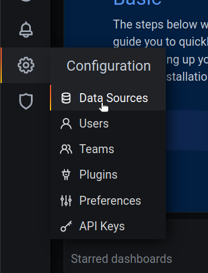
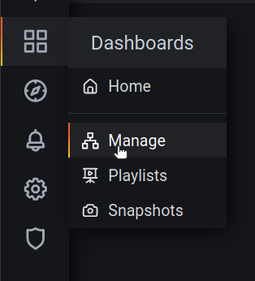
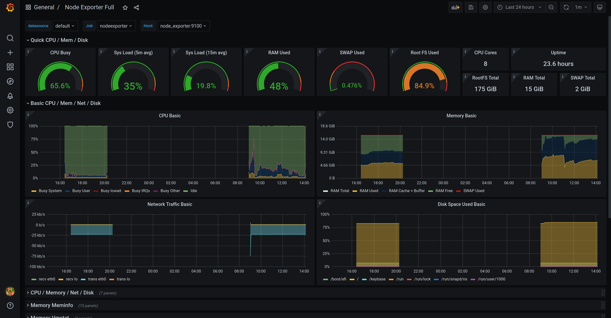

# MonitorinGrafana

A [docker compose](./docker-compose.yml) example to monitor a local computer
with Grafana, Prometheus, its alert manager and node-exporter.

## Setup

### Installation
`make up`

### Grafana configuration

##### Data source

Open a browser and connect to http://localhost:3000

On the homepage, select configuration → Data Source

Add new data source

Choose Prometheus

On the configuration panel, set the access method to "Browser". Just keep the default url http://localhost:9090

Save and test.

##### Dashboard

Go to Dashboard → Manage

Click on Import

Type [1860]()https://grafana.com/grafana/dashboards/1860-node-exporter-full/ and Load

Select prometheus as the data source and Import.

So now, you have a fully working monitoring board. Enjoy !

### Alert manager

Before anything, copy the `alertmanager/config.sample.yml` to
`alertmanager/config.yml` and change the bot's token and the chat_id. The
[./prometheus/rules/alert-all-the-time.yml](./prometheus/rules/alert-all-the-time.yml)
file is configured to send an alert to this receiver (telegram).

Visit http://localhost:9093 to see the alert manager UI.

You can add some alerts to the
[./prometheus/rules](./prometheus/rules) folder. See [Samber's
awesome-prometheus-alerts](https://samber.github.io/awesome-prometheus-alerts/rules.html)
for some idea.
